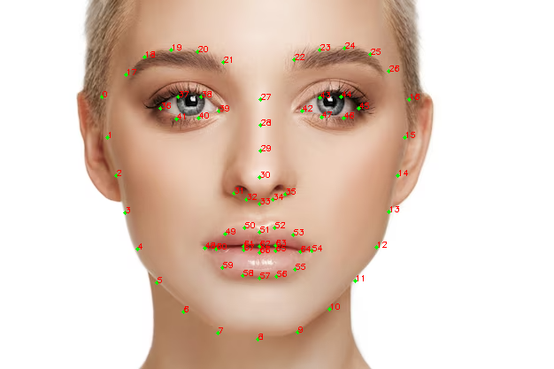

# Facial-Expression-Recognition
Utilized Chatgpt for insight on aspects of the implementation [chat history](https://chat.openai.com/c/8751a64b-c174-4492-8099-bf85d5cb9b8c)

### Feature Extraction using Dlib
In Dlib's 68 facial **landmark** detector, each of the 68 landmarks corresponds to a specific facial feature. These landmarks are a standard way to map the human face, allowing for detailed facial analysis. Here is an explanation of what each group of landmarks represents:

- **Jawline (1-17)**: These landmarks trace the jawline from ear to ear.

- **Right Eyebrow (18-22)**: These points map the right eyebrow.

- **Left Eyebrow (23-27)**: These points map the left eyebrow.

- **Nose Bridge (28-31)**: These landmarks follow the line of the bridge of the nose.

- **Lower Nose (32-36)**: These points outline the bottom part of the nose, including the nostrils.

- **Right Eye (37-42)**: This set maps out the right eye, including the corners and the eyelid.
    - (37, 38): top eyelid
    - (36): left corner
    - (40, 41): bottom eyelid
    - (39): right corner
- **Left Eye (43-48)**: Similarly, these landmarks map out the left eye.
  - (42): left corner
  - (43, 44): top eyelid
  - (45): right corner
  - (46, 47): bottom eyelid

- **Outer Lip (49-60)**: These points follow the outer edge of the lips, both the top and bottom lips.
  - (48): left corner
  - (49, 53): top outer lip
  - (54): right corner
  - (55, 59): bottom outer lip

- **Inner Lip (61-68)**: These landmarks trace the inner edge of the lips.
  - (60): left corner
  - (61, 63): top inner lip
  - (64): right corner
  - (65, 67): bottom inner lip

**The landmarks are shown in the image below**

Using these landmarks, we are able to compute different metrics that will help us classify the facial expressions. These metrics / features are:

- Eye Aspect Ratio - The ratio of the width of the eye to the height of the eye. This metric is used to determine how wide open the eye is.
- Mouth Aspect Ratio - Same measure as the eye aspect ratio, but computed for the mouth.
- Distance between inner eyebrow corners - Could be used to determine how furrowed the eyebrows are.
- Curvature of certain facial landmarks: This is a measure of how curved facial landmark is, we return a vector containing the area under the curve, the max curvature and the mean curvature for the following landmarks:
  - Eyebrows
  - Top and bottom inner lips

- Distance between the corners of the mouth
